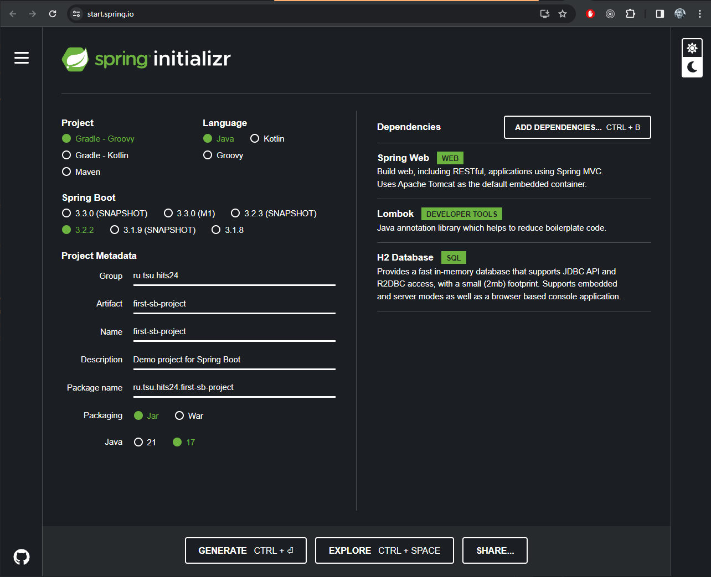

# Рекомендации по освоению Java

## Java

Сам язык можно изучать из различных источников. Конкретной книги, обязательной к прочтению, не существует.
Можно посмотреть в сторону онлайн-курсов или книг, вот например на сайте курсов что рекомендуют: [javarush](https://javarush.ru/groups/posts/top-7-knig-po-java#Java-8-%D0%A0%D1%83%D0%BA%D0%BE%D0%B2%D0%BE%D0%B4%D1%81%D1%82%D0%B2%D0%BE-%D0%B4%D0%BB%D1%8F-%D0%BD%D0%B0%D1%87%D0%B8%D0%BD%D0%B0%D1%8E%D1%89%D0%B8%D1%85).
В числе прочих рекомендуют Герберта Шилдта.

Изучать необязательно 17 версию java, можно читать книгу и по 11, а затем просто погуглить разницу между 11 и 17

Темы для изучения java
- Коллекции (в целом структуры данных, в т.ч. Map)
- Исключения
- Потоки IO
- Stream API
- Функциональные интерфейсы, лямбды
- Дженерики
- Lombok. Хоть сам lombok - это уже библиотека java, а не часть языка, его надо изучить сразу, т.к. он очень хорошо дополняет язык

## Spring Framework

Основой приложения должен быть Spring Boot. Надо понимать, что Spring Boot - это некий готовый набор конфигураций,
и с ним легко начать разработку в отличие от голого Spring Framework. Так же Spring Boot включает в себя по дефолту
веб-сервер Apache Tomcat. Соответственно, можно создать проект на основе spring boot с использованием БД и с
rest-контроллерами, и это всё может запуститься без единой правки конфигов.

### Где читать про Spring Boot и как начать с ним работать

Для начала есть перевод статьи на хабре: [Что такое Spring Framework? От внедрения зависимостей до Web MVC](https://habr.com/ru/post/490586/)  
В ней объясняется принцип работы ядра Spring и какие проблемы он решает, а так же про некоторые модули Spring, строящиеся над ядром.

На сайте [start.spring.io](https://start.spring.io/) можно сгенерировать код проекта, указав нужные зависимости.  
  
Здесь в блоке слева нужно выбрать версию java/spring, указать инфо о проекте, а в списке справа накидать нужных зависимостей
и нажать кнопку Generate. Пример на картинке выше.

На официальном сайте [spring.io](https://spring.io/projects/spring-boot) есть документация по Spring Boot и его модулям.
Самый важный раздел в первую очередь - Spring Data, в частности по JPA и JDBC - наиболее часто используемые модули в проектах.
Читать все статьи нет нужды, т.к. это очень затратно по времени. Рекомендуется осваивать только тот материал, который требуется
по конкретной задаче/проекту. Для более общего ознакомления с техами, которые в данный момент не нужны, можно посмотреть
записи java-конференций по этим техам.

Так же очень популярный сайт с гайдами и полезными статьями: [Baeldung](https://www.baeldung.com/). Его преимущество в
том, что статьи регулярно актуализируются, вероятность напороться на неактуальную статью мала.
