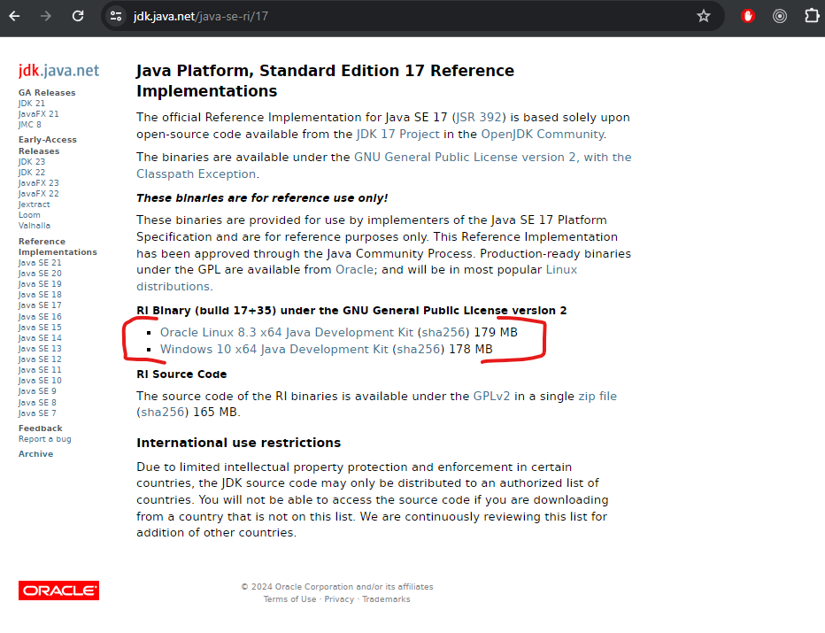
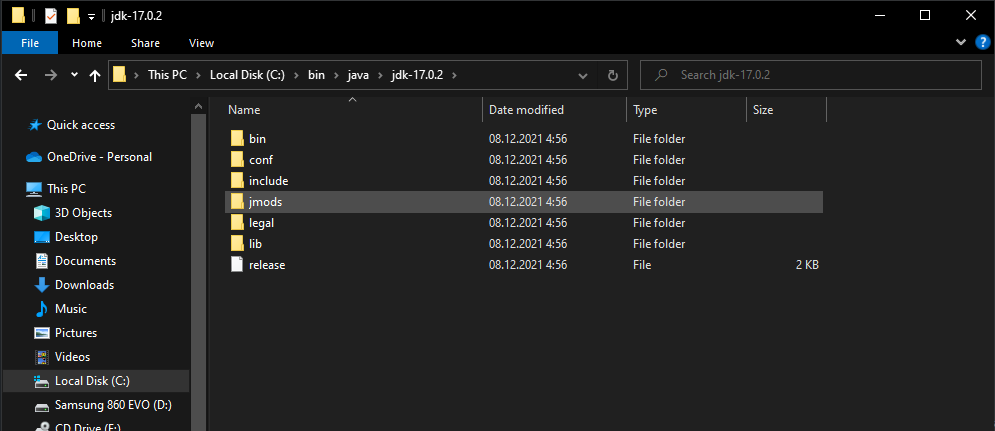
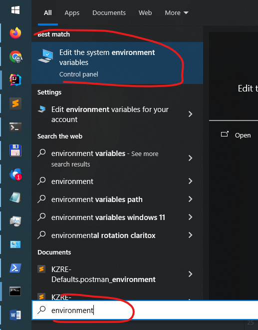
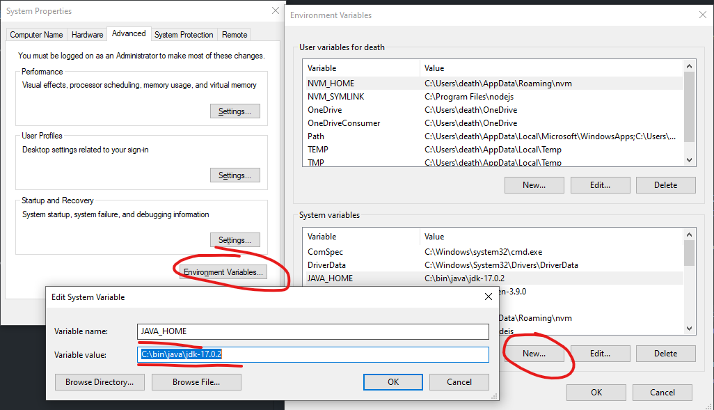
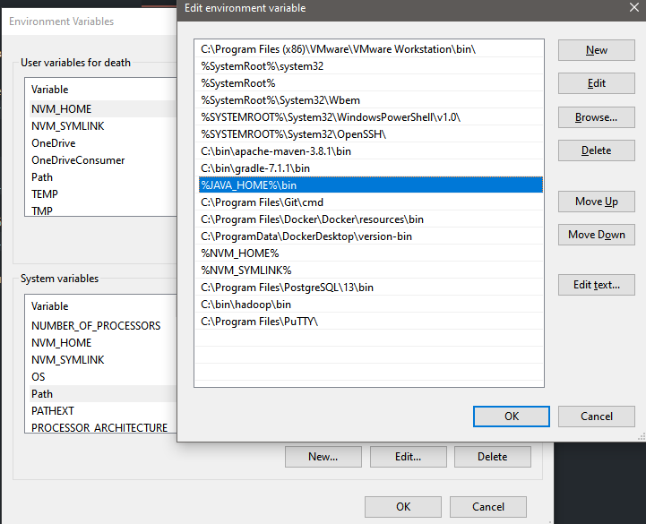
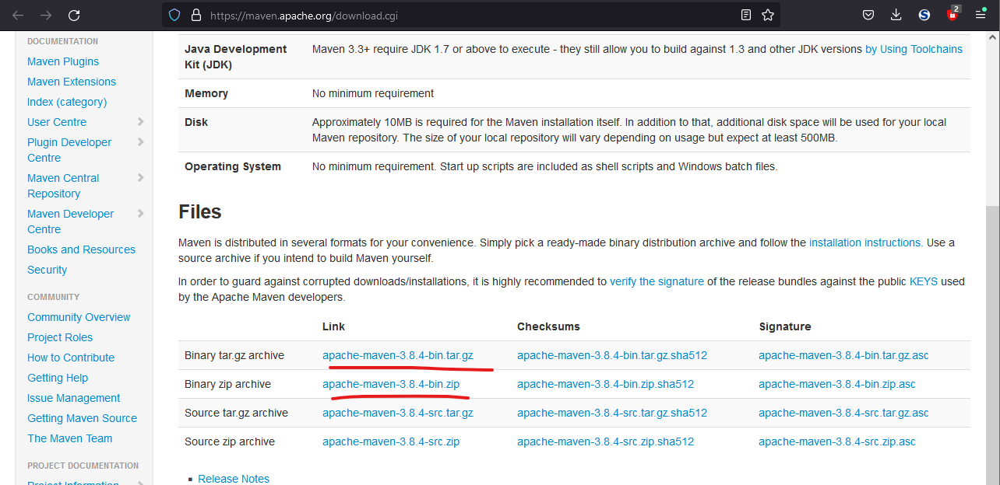
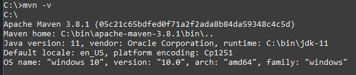

## Среда разработки

## Версии технологий

Версии технологий ограничены следующим образом
- Java 17
- Spring Boot 3

### 1. Установка JDK 17 (Windows)

Установщик OpenJDK 17 можно скачать отсюда: [jdk.java.net](https://jdk.java.net/java-se-ri/17)  


Для установки скачать архив `Windows/x64 Java Development Kit` и распаковать, например, в директорию `C:\bin\java`  
Содержимое `C:\bin\java\jdk-17.0.2` (как эта папка выглядит у меня):    


Далее надо добавить переменную окружения `JAVA_HOME` со значением `C:\bin\java\jdk-17.0.2`:  



Там же нужно найти переменную окружения Path и добавить в ней путь к bin нашего jdk: `%JAVA_HOME%\bin`  


Чтобы проверить, что изменения применились, нужно открыть новое окно консоли/терминала и там ввести `java -version`
и `javac -version`, в консоли не должно быть ошибок, вывод должен выглядеть примерно так:  
```
C:\>java -version
openjdk version "17.0.2" 2022-01-18
OpenJDK Runtime Environment (build 17.0.2+8-86)
OpenJDK 64-Bit Server VM (build 17.0.2+8-86, mixed mode, sharing)

C:\>javac -version
javac 17.0.2
```

Аналогичным образом установка делается в линуксах, отличается только способ установки переменных окружения и пути размещения
бинарников. Не рекомендуется делать настройку из под root, лучше всё делать от обычного пользователя и размещать бинарники
в его home-директории, чтобы в будущем не возникало проблем с правами доступа.

### 2. Установка Apache Maven
Apache Maven - система организации структуры проекта, сборки и зависимостей (если вкратце). Установка производится либо
бинарником, либо из архива аналогично как JDK, скачать отсюда: [maven.apache.org](https://maven.apache.org/download.cgi)  


Скачать и распаковать архив в C:\bin, получится: `C:\bin\apache-maven-3.8.4`  
Таким же путём, как и выше по JDK, создать переменную окружения `M2_HOME` со значением `C:\bin\apache-maven-3.8.4`  
В переменную `Path` добавить значение `%M2_HOME%\bin`  
После этого открыть новое окно консоли/терминала и выполнить команду `mvn -v`:  


**Примечание:** на скрине иная версия Apache Maven, автор устанавливал свой maven раньше написания инструкции. После
публикации инструкции версия может стать новее, чем 3.8.4 - надо не забыть про это при установке значений переменным.

### 3. Установка IDE: IntelliJ IDEA
Рекомендуется JetBrains IntelliJ IDEA Ultimate. Для студентов выдаются бесплатные лицензии, за подробностями идти на
их [сайт](https://www.jetbrains.com/ru-ru/community/education/#students). Можно и другую IDE, не от JetBrains, но с
технологиями из курса лучше всего интегрированы среды разработки от JetBrains


> Примечание. В JetBrains IntelliJ IDEA Ultimate уже есть свой встроенный maven, а так же есть возможность
> скачивания JDK по кнопке в настройках. Разрешается так и поступать, но тогда выши проекты будут сильно
> завязаны на IDE, а за её рамками сложно будет что-то сделать, так что рекомендуется использовать именно
> собственноручно установленные JDK и Maven